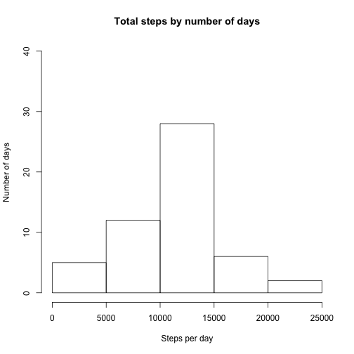
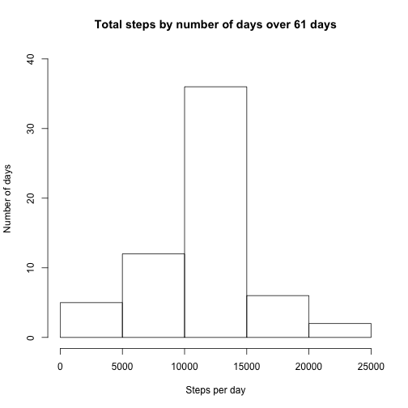
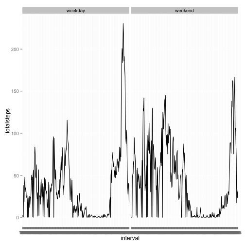

Reproducible Data:  Peer Assessment 1  
Carla Bates  
March 2015  

---

## Overview

The purpose of this assignment is to create a R markdown document that includes R code and its output and to produce an html page from the R markdown document via knitr. 

The report is structured around a series of questions related to data gathered from a personal activity monitoring device which was worn for two months by one individual.  The data is stored as a CSV file.  It includes a total of 17,568 observations of three variables:  steps (the number of steps taken in a 5 minute interval), date (the date of the reading), and interval (the specific 5 minute interval being measured).

The six sections below correspond to the six sections of the assignment.

---

## Loading and preprocessing data    

The data was provided as part of the assignment.  I downloaded it and saved it to my working directory. I then prepared the R environment by loading the packages I would need for the assignment and reading the data into a data frame named x.  I needed to set the classes of the variables because 1) the date variable will be easier to convert from type character rather than the default type of factor and 2) questions in the assignment require the interval variable to act as a categorical variable which is facilitated by typing it as character.

Note:  In order to avoid reults returned as scientific notation, I set options to round to two decimal places.


```r
library(dplyr)
library(lubridate)
library(knitr)
library(ggplot2)
library(chron)

x <- read.csv("activity.csv", 
              stringsAsFactors = F, 
              colClasses=c("numeric","character","character"))

options(scipen = 1, digits = 2)
```
  
---

## What is mean total number of steps taken per day? 

The code below depends on the dplyr package to create a dataset capturing the total number of steps taken per day over the two month period.  The histogram then cuts the data to display how manys days the stotal steps taken falls into the range of total steps.  For 5 days, the individual ranged under 5000 steps, while the individual had almost 30 days of between 10 and 15 thousand steps. 

Cleansteps is the data frame without missing values.  

  

```r
cleansteps <- x[!is.na(x$steps), ]

stepsperday <- cleansteps %>% 
    group_by(date) %>% 
    transmute(totalsteps=sum(steps))

stepsperday <- distinct(select(stepsperday, date, totalsteps))

hist(stepsperday$totalsteps, 
     main="Total steps by number of days", 
     xlab="Steps per day", 
     ylab="Number of days", ylim=c(0,40))
```

 

```r
steps <- c(mean(stepsperday$totalsteps), median(stepsperday$totalsteps))
```


The mean of total steps is 10766.19 and the median is 10765.

---

## What is the average daily activity pattern?

A time series of the number of steps averaged during over the 5 minute intervals taken each day during the two months is below:


```r
stepsperinterval <- cleansteps %>% 
    group_by(interval) %>% 
    transmute(meansteps=mean(steps))

stepsperinterval <- distinct(select(stepsperinterval, interval, meansteps))

with(stepsperinterval, 
     plot(interval, meansteps, 
          type="l", 
          main="Time series of average steps taken, \n across 2 months, in 5 minute intervals", 
          xlab="Interval", 
          ylab="Mean steps per interval"))
```

 


```r
themax <- stepsperinterval[stepsperinterval$meansteps == max(stepsperinterval$meansteps), ]
maxsteps <- c(themax$meansteps)
maxinterval <- c(themax$interval)
```

The maximum average number of steps was 206.17 which occured during interval 835.

---

##  Imputing missing values


```r
xna <- x[is.na(x$steps)|x$interval == "NA"|x$date == "NA", ]
tna <- tally(xna)
```

The total number of rows with missing values is 2304.  I will impute the missing values by using the mean for that 5 minute interval averaged across the two months. 


```r
y <- x

for(i in 1:nrow(x)){
  if(is.na(x$steps[i])){
    for(j in 1:nrow(stepsperinterval))
      if(x$interval[i] == stepsperinterval$interval[j])
        x$steps[i] <- stepsperinterval$meansteps[j]  
  }
}

stepsplus <- x %>% 
    group_by(date) %>% 
    transmute(totalsteps=sum(steps))

stepsplus <- distinct(select(stepsplus, date, totalsteps))

hist(stepsplus$totalsteps, 
     main="Total steps by number of days over 61 days", 
     xlab="Steps per day", 
     ylab="Number of days", 
     ylim=c(0,40))
```

 

```r
moresteps <- c(mean(stepsplus$totalsteps), median(stepsplus$totalsteps))
```

After imputing missing values, the mean is 10766.19 and the median is 10766.19 The mean and median do not change from the mean and median found from the data set without the imputed values.  The impact of adding the imputed values just seemed to amplify those days when total steps feel into the median quintile, the days when the individual took 10 to 15 thousand steps.

## Are there differences in activity patterns between weekdays and weekends?


```r
stepswday <- x %>% mutate(datel=ymd(date))
stepswday <- stepswday %>% mutate(wday=is.weekend(datel))
stepswday$whatday <- factor(stepswday$wday, labels=c("weekday", "weekend"))

stepswdayinterval <- stepswday %>% 
    group_by(whatday, interval) %>% 
    transmute(totalsteps=mean(steps))

stepswdayinterval <- stepswdayinterval %>% distinct(interval) %>% select(whatday, totalsteps)
```


```r
p <- ggplot(stepswdayinterval, aes(interval, totalsteps, group = 1)) + geom_line()
p + facet_grid(. ~ whatday)
```

 


